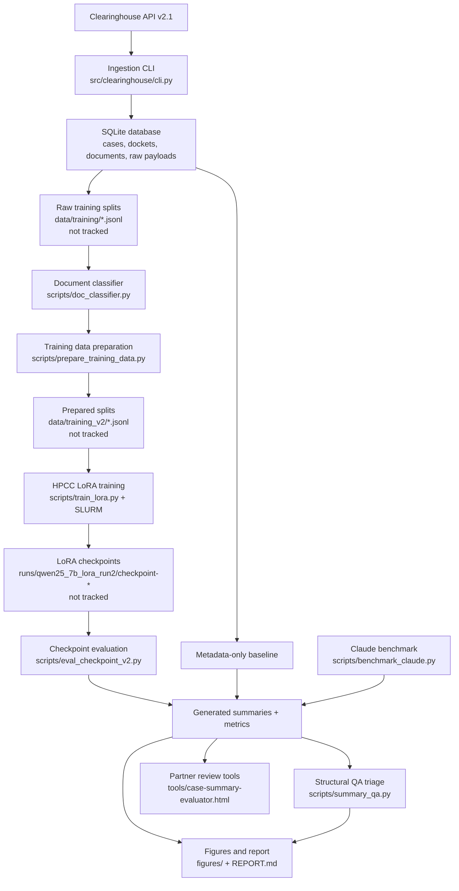

# Final Submission Map

This file explains how the final deliverables fit together. It is meant to answer the main code-review concern: the project had working pieces, but the data flow and purpose of each command were hard to see.

## Reviewer Path

Start here if you are grading or reviewing the project:

1. `INSTALL.md` - local setup, tests, and the shortest mock demo.
2. `TUTORIAL.md` - full walkthrough from mock ingestion through HPCC training, evaluation, QA, and figures.
3. `REPORT.md` - final technical report and results.
4. `notebooks/figure_instructions.ipynb` - figure reproduction notebook.
5. `tools/README.md` - partner-facing browser tools.
6. `scripts/README.md` - training, evaluation, QA, and helper script guide.

## Final Deliverables

| Deliverable | Path | Purpose |
|-------------|------|---------|
| Final report | `REPORT.md` | Main written report with methods, results, and figures |
| Sharing plan | `SHARING_PLAN.md`, `UofM_SHARING_PLAN.pdf` | Partner/reviewer-facing setup and sharing instructions |
| Presentation plan | `20260410_Final_Presentation_Plan_CivilRightsSummarizedAI.md`, `20260410_Final_Presentation_Plan_CivilRightsSummarizedAI.pptx` | Final video and symposium talk plan |
| Progress deck | `Civil_Rights_AI_Progress.pptx` | Earlier progress presentation |
| Guided tutorial | `TUTORIAL.md` | Step-by-step reproducibility walkthrough |
| Figure notebook | `notebooks/figure_instructions.ipynb` | Regenerates project figures from bundled fixtures or evaluation outputs |
| Partner browser tools | `tools/` | Standalone generator, evaluator, QA checker, and local API proxy |
| Pipeline package | `src/clearinghouse/` | Ingestion, clients, storage, processing, and CLI |
| Training/eval scripts | `scripts/`, `eval/` | Data prep, LoRA training, checkpoint evaluation, Claude benchmark, QA triage |
| Small fixtures | `data/fixtures/` | Shareable data for tests, demos, and figure fallbacks |

## Data Processing Figure

## What Is Reproducible Without Private Data

These steps work from the public repository alone:

- Install the package with `pip install -e ".[dev]"`.
- Run `pytest -q`.
- Run `python -m clearinghouse.cli ingest-mock`.
- Inspect the mock SQLite database at `data/dev.db`.
- Reproduce fixture-backed figures in `notebooks/figure_instructions.ipynb`.
- Open the standalone browser QA tools in `tools/`.

These steps require extra access:

- Live ingestion requires a Clearinghouse API token.
- Claude generation/judging requires `ANTHROPIC_API_KEY`.
- Full training requires the large private JSONL splits in `data/training/`.
- Local model evaluation requires LoRA adapter/checkpoint files in `runs/`.

## Included Data Metadata

The repository includes small fixtures, not the full corpus. Their provenance is documented in `data/fixtures/README.md`.

| Fixture | What it supports |
|---------|------------------|
| `mock_dataset.json` | Unit tests and mock ingestion demo |
| `trainer_state.json` | Training dynamics figure |
| `test_chunk_counts.json` | Prompt/document fragmentation figure |
| `eval_summary.json` | Fallback aggregate evaluation figure |
| `eval_scores.jsonl` | Fallback per-record score distribution figure |

The full training data is intentionally excluded from git. It is described in `data/training/README.md`.

## QA and Evaluation Meaning

The final results are not based on one metric. We used several checks because legal summaries fail in different ways:

| Layer | Script/tool | Meaning |
|-------|-------------|---------|
| ROUGE | `eval/evaluate.py`, `scripts/eval_checkpoint*.py` | Word and phrase overlap with reference summaries |
| BERTScore | `eval/evaluate.py` | Semantic similarity with reference summaries |
| LLM-as-judge | `eval/evaluate.py`, `scripts/benchmark_claude.py` | Rubric scoring for factuality, completeness, style, legal reasoning, and overall quality |
| Structural QA | `scripts/summary_qa.py` | Reference-free triage for broken dates, raw-document artifacts, missing elements, repetition, and length collapse |
| Source attribution | `final-additions/attribution` in the working archive, summarized in `REPORT.md` | Whether generated sentences are grounded in source documents |

`summary_qa.py` emits:

- `PASS`: no critical or warning flags.
- `REVIEW`: warning flags; human editor should inspect.
- `REJECT`: critical flags; output should not be used without regeneration or heavy editing.

This QA layer is why the checkpoint decision is clear. Checkpoint 3000 had a better QA profile than checkpoint 3690 even though raw ROUGE differences were small. The final checkpoint overfit and produced garbled date artifacts, so the project recommendation is not "use the last checkpoint"; it is "evaluate checkpoints and route outputs through QA."

## Partner-Facing Tools

The `tools/` directory contains standalone browser tools designed for lightweight partner review:

- `case-summary-generator.html`: drafts a case summary from metadata, source documents, or Clearinghouse API data through the local proxy.
- `case-summary-evaluator.html`: reviews a generated package, runs local QA, optionally compares with a reference, and can call Claude for source-grounding review.
- `summary_qa_standalone.html`: paste-in browser version of the structural QA checks.
- `clearinghouse_api_proxy.py`: localhost-only proxy that serves the generator/evaluator and forwards authenticated Clearinghouse API v2.1 requests.
- `case_review_tool.py`: Python tool for reference-free QA plus optional Claude source-citation review over batch outputs.

These tools are not a production integration. They are handoff prototypes that show the recommended workflow: draft, expose sources, triage, and require human review.

## What Not To Commit

Do not commit:

- `.env` or API keys.
- `.Rhistory`, `.DS_Store`, `__pycache__/`, or `.pyc` files.
- `data/dev.db`.
- Full training JSONL files under `data/training/`.
- Prepared training files under `data/training_v2/`.
- Model checkpoints or adapter weights under `runs/`.
- Large raw evaluation JSONL files unless intentionally reduced into a fixture.
