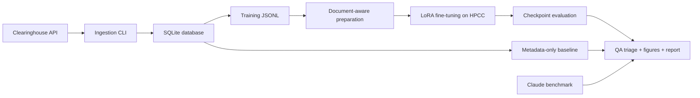

# Civil Rights Summarized AI

Multi-document legal case summarization pipeline for the Civil Rights Litigation Clearinghouse using ingestion, LoRA fine-tuning, and automated evaluation.

## Start Here

1. [INSTALL.md](INSTALL.md) - shortest setup, tests, and no-private-data demo.
2. [TUTORIAL.md](TUTORIAL.md) - full walkthrough for graders, live API users, and ML/HPCC reproduction.
3. [FINAL_SUBMISSION.md](FINAL_SUBMISSION.md) - final deliverable map, data-flow diagram, QA meaning, and tool index.

## Quick Smoke Test

```bash
git clone https://github.com/thinq8/CivilRightsSummarizedAI.git
cd CivilRightsSummarizedAI
python3 -m venv .venv
source .venv/bin/activate
python -m pip install --upgrade pip "setuptools<82" wheel
python -m pip install -e ".[dev]"
pytest -q
python -m clearinghouse.cli ingest-mock
```

Expected results:

- `pytest -q` prints `4 passed` or more if new tests have been added.
- `ingest-mock` prints `cases=2 dockets=2 documents=4 errors=0`.

The smoke test uses only bundled synthetic fixture data. It does not require Clearinghouse credentials, private training data, model weights, or API keys.

## Pipeline Overview



The project’s main technical finding is that the final training checkpoint was not the best model. Checkpoint 3000 had a better QA profile than checkpoint 3690, which overfit and produced malformed date artifacts. The final recommendation is a hybrid workflow: draft with the safest available route, run structural QA, and keep human editorial review in the loop.

## Repository Map

| Path | Purpose |
|------|---------|
| `src/clearinghouse/` | Installable ingestion package, clients, storage models, processing, and Typer CLI |
| `scripts/` | Data preparation, LoRA training, checkpoint evaluation, Claude benchmark, and QA triage |
| `eval/` | Generation and scoring pipeline for local model or Claude outputs |
| `tools/` | Standalone browser generator/evaluator/QA prototypes and local API proxy |
| `notebooks/figure_instructions.ipynb` | Reproduces the seven final report figures from bundled aggregate fixtures |
| `data/fixtures/` | Small non-private fixtures for tests, figures, and demos |
| `figures/` | Final report figures |
| `tests/` | Unit tests and documentation consistency checks |
| `REPORT.md` | Final technical report |
| `SHARING_PLAN.md` | Nontechnical sharing and reviewer handoff guide |

## What Is Not Bundled

The public repository does not include full training JSONL files, prepared training splits, model checkpoints, large raw evaluation outputs, or API keys. The included fixtures are intentionally small and documented in [data/fixtures/README.md](data/fixtures/README.md). If you are receiving the larger handoff package outside git, keep the repo-relative paths described in [INSTALL.md](INSTALL.md) and [FINAL_SUBMISSION.md](FINAL_SUBMISSION.md).

## References

- Civil Rights Litigation Clearinghouse: <https://clearinghouse.net>
- Clearinghouse API docs: <https://api.clearinghouse.net>
