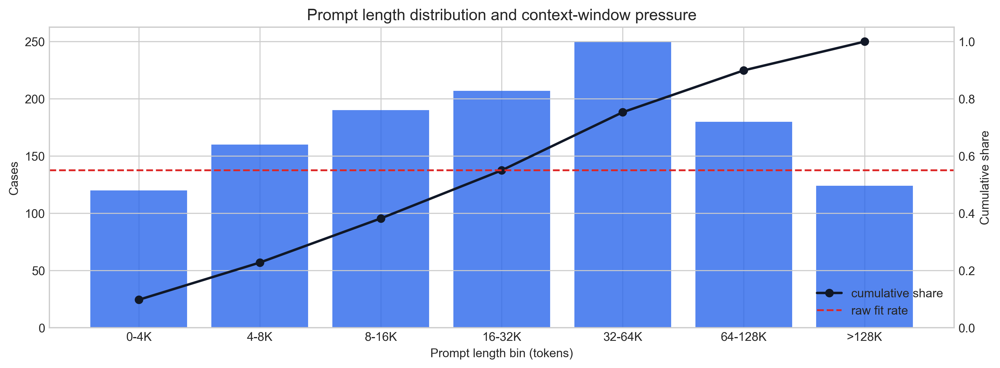
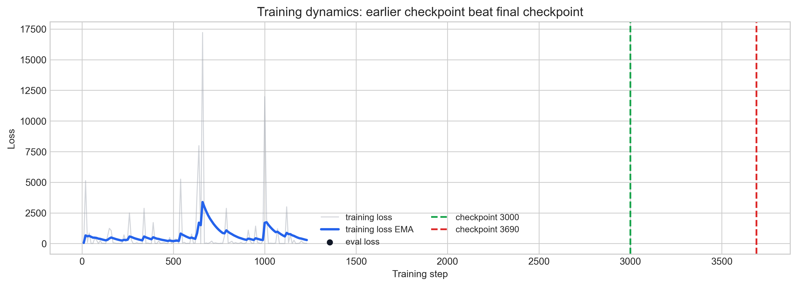
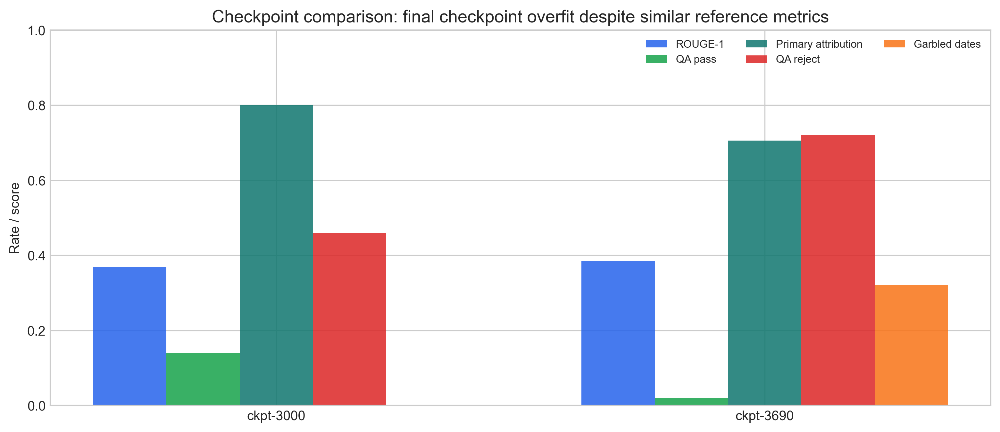
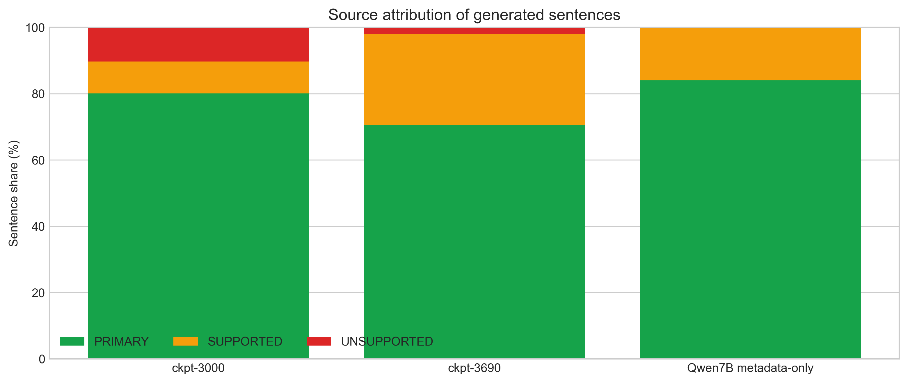
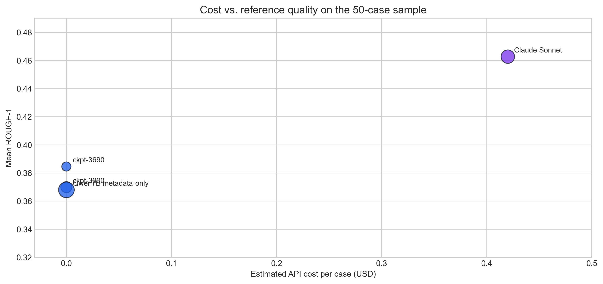
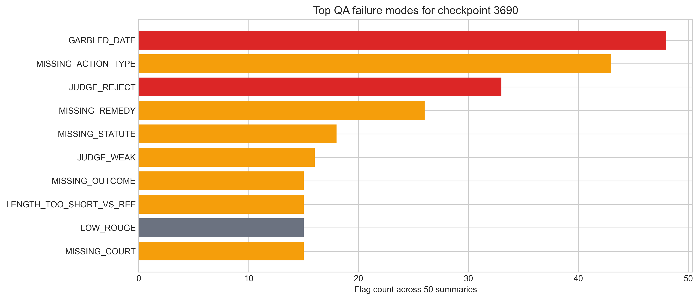

# Civil Rights Summarized AI — Final Report

**Course:** CMSE 495 Capstone, Michigan State University
**Team:** Liam Sandy, Nick Sleeper, Ishmail Khan, Jayant Sahai
**Community Partner:** Civil Rights Litigation Clearinghouse (University of Michigan Law School)
**Date:** April 18, 2026

---

## 1. Abstract

We fine-tuned Qwen2.5-7B-Instruct with LoRA on ~9.8K Civil Rights Litigation Clearinghouse cases to attempt to produce publishable quality case summaries, then evaluated the result against three other systems on the same 50-case test set: the same base model given only structured database metadata (no documents), Claude Sonnet 4.6 called interactively through Claude Code, and an API cost estimate for the same Sonnet model. The fine-tune works around half the time and is free to run after training, the metadata-only baseline hallucinates nothing and passes QA 52% of the time at 50× less input cost, and Claude Sonnet is the measured quality ceiling — ROUGE-1 0.463 and BERTScore F1 0.196, both well above any other system we tested.

The single most important finding is that **more training made the model worse.** An early checkpoint (step 3000) passed our automated QA triage 14% of the time, while the final checkpoint (step 3690) passed only 2% and rejected 72%. A naive "ship the last checkpoint" workflow would have delivered the worse model. We also shipped an automated QA tool (`summary_qa.py`) that flags garbled dates, raw-document regurgitation, and length collapse without needing a reference summary, and a cost/quality comparison that argues for a hybrid routing strategy rather than picking a single system.

---

## 2. Introduction

### 2.1 The problem

The Civil Rights Litigation Clearinghouse maintains one of the most comprehensive archives of civil rights lawsuits in the United States. Documenting cases ranging from police reform, voting rights, immigration detention, prison conditions, disability rights, and more. Every case has to be hand-summarized by a legal editor into a standardized, publishable format. That manual process is the bottleneck that uses hours of time for Clearinghouse staff.

### 2.2 Research question

> Can a small, self-hosted language model produce Clearinghouse quality summaries well enough to meaningfully accelerate the editorial pipeline, and at what cost-quality trade-off against frontier commercial models?

### 2.3 What we built

1. A resilient ingestion pipeline from the Clearinghouse API into a local SQLite database
2. A document-type-aware training data preparation pipeline with three selection strategies
3. A multi-stage LoRA fine-tune of Qwen2.5-7B-Instruct on MSU HPCC A100/H200 GPUs
4. A four-layer evaluation framework (ROUGE + BERTScore + LLM-as-judge + structural QA triage)
5. A metadata-only baseline that tests whether structured fields alone are enough
6. A cost/quality benchmark against Claude Sonnet 4.6 (run interactively through Claude Code)
7. A standalone QA triage CLI (`summary_qa.py`) with a self-contained HTML dashboard
8. A pair of partner-facing standalone browser tools: a case-summary generator and evaluator that support metadata-only drafting, metadata-plus-document drafting, source review, Claude judging, and human feedback export
9. A single showcase notebook (`project_showcase.ipynb`) that runs end-to-end from bundled artifacts

### 2.4 Why summarizing legal cases is different from generic summarization

- Cases span dozens of documents filed over years or decades.
- Document types differ wildly in informational value a 40-page opinion matters, a 200-entry PACER docket does not.
- Summaries have to use precise legal terminology and stay factually grounded.
- The narrative has to follow a specific editorial structure: stakes → filing → claims → procedural history → outcome.

---

## 3. Data

### 3.1 Source

All data comes from the Civil Rights Litigation Clearinghouse API (`https://clearinghouse.net/api/v2p1`). The Clearinghouse catalogs federal civil rights cases with structured metadata and human written case summaries authored by legal editors.

### 3.2 Dataset

| Split | Records | Purpose |
|-------|---------|---------|
| Train | 9,841 | Fine-tuning |
| Validation | 1,231 | Early stopping, hyperparameter tuning |
| Test | 1,231 | Final evaluation (50 sampled for deep eval) |

Each record contains a concatenated prompt (case documents), a reference summary written by Clearinghouse staff, and structured metadata (source chunk count, case ID, split assignment).

### 3.3 The fragmentation problem

Legal cases are long and heterogeneous. On our data:

- Median of **11.6 documents per case**, up to **405** on the heaviest case.
- Document size ranges from a few hundred tokens (a docket entry) to 100K+ tokens (a lengthy appellate opinion).
- Only **55% of raw training prompts** fit inside Qwen2.5-7B's 32K context window.
- **80% of cases** include PACER dockets, correspondence, or administrative filings — documents that burn context without contributing to the summary.

This is the central data engineering challenge. If you naively concatenate everything, almost half your training set gets silently truncated and the model trains on garbage.



*Figure 2 — Prompt length distribution on the test split. The histogram (left) is dominated by short cases but has a long tail; the cumulative curve (right) crosses the 32K context line at about the 55th percentile.*

### 3.4 NDA and data sharing

The training data is derived from public court documents and Clearinghouse metadata. The human written reference summaries are the intellectual property of the Clearinghouse. Training data files are not bundled in the repository due to size (~3.5 GB) — they can be rebuilt with the ingestion pipeline and Clearinghouse API credentials. The repository ships a small fixture dataset (`data/fixtures/`) that is enough to reproduce every figure in this report and all unit tests.

---

## 4. Methods

### 4.1 Ingestion pipeline

`src/clearinghouse/` ingests from the API into a normalized SQLite database:

- **Normalized schema:** cases, dockets, and documents as SQLAlchemy ORM tables.
- **Bronze-layer archiving:** raw JSON payloads preserved for schema evolution and audit.
- **Resumable:** the pipeline checkpoints by case, so it can be restarted after an interruption without redoing work.
- **Rate-limiting + retry:** exponential backoff with jitter, respects the Clearinghouse's rate limits.

### 4.2 Document classification and selection

`scripts/doc_classifier.py` classifies each document chunk into a four-tier priority scheme:

| Tier | Label | Document types | Strategy |
|------|-------|----------------|----------|
| 1 | PRIMARY | Opinions, orders, judgments, consent decrees, settlements | Always include |
| 2 | SUPPORTING | Complaints, MTD / MSJ / class cert motions | Include if space |
| 3 | CONTEXTUAL | Replies, responses, amicus briefs, generic motions | Include selectively |
| 4 | EXCLUDED | Dockets, PACER entries, correspondence, press releases | Drop by default |

### 4.3 Training data preparation

`scripts/prepare_training_data.py` implements three selection strategies:

1. **Priority Filter.** Greedy fill by tier. When Tier 1 alone exceeds the token budget, allocate proportionally across Tier 1 documents rather than exhausting the budget on the first one.
2. **Structured.** Reformat each prompt with an explicit case timeline, document role labels (`[PRIMARY]`, `[SUPPORTING]`), and instructions at the end of the prompt (closer to generation for better attention).
3. **Extract First (two-stage).** Pre-extract structured facts from each document using document-type-specific prompts (adapted from the Clearinghouse's court-document-summarizer HTML tool), then train on the synthesis task (condensed facts → narrative summary). Supports Claude API, local model, or heuristic extraction backends.

| Strategy | Context fit rate | Median tokens | Mean docs included |
|----------|-----------------|---------------|-------------------|
| Raw (no processing) | 55% | 27,000 | 11.6 / 11.6 |
| Priority Filter | 84% | 14,560 | 4.1 / 6.0 |
| Structured | 92% | 14,591 | 4.1 / 6.0 |
| Extract First | 98% | 4,548 | 4.7 / 5.2 |

### 4.4 Model fine-tuning

**Base model:** `Qwen2.5-7B-Instruct` — strong instruction following at 7B parameters, permissive license, 128K native context window.

**Adapter:** LoRA via PEFT. Rank 16, alpha 32, dropout 0.05, target modules = all linear layers (q/k/v/o/gate/up/down). Trains ~0.3% of parameters; base weights stay frozen.

**Trainer:** TRL `SFTTrainer` with completion-only loss.

**Hardware:** MSU ICER HPCC, NVIDIA A100 80GB and H200, SLURM.

**Run 1 — baseline, raw data.** Learning rate 1e-4, 1 epoch, max_length 4096. Failed: training loss bounced between 52 and 5130, eval losses were NaN. Root cause was a combination of 45% of prompts exceeding the context window, learning rate too high, no gradient clipping.

**Run 2 — improved, extract_first data.** Learning rate 2e-5, 3 epochs, max_length 8192, gradient clipping 1.0. Completed training cleanly. Loss EMA reached its minimum at step **3000** and drifted upward to step **3690** where training terminated. Both checkpoints were kept for head-to-head evaluation; this decision turned out to matter (§5.2).

### 4.5 Evaluation framework

No single metric captures summarization quality. We used four complementary layers:

| Layer | Metric | What it measures | Needs reference? |
|-------|--------|------------------|------------------|
| Lexical | ROUGE-1/2/L/Lsum | Overlap of unigrams / bigrams / longest common sequences | Yes |
| Semantic | BERTScore (rescaled) | Contextual embedding similarity | Yes |
| Rubric | LLM-as-judge (5 dims × 1–5) | Factuality, completeness, conciseness, legal reasoning, overall | No |
| Structural | `summary_qa.py` triage | Catches failure modes regardless of reference | No |

We also added two post-MVP layers:

- **TF-IDF source attribution.** For each predicted sentence, classify as `PRIMARY` (supported by a top-tier document), `SUPPORTED` (supported by any source), or `UNSUPPORTED`. Gives a grounding fraction per system.
- **Automated QA triage** (`scripts/summary_qa.py`). Flags garbled dates, raw-document regurgitation (`[DOCUMENT]`, `<|user|>` leaks), length collapse, missing required sections, and repetition loops. Emits `PASS / REVIEW / REJECT` per record plus a self-contained HTML dashboard.

**A note on LLM-as-judge.** We initially tried using Qwen-7B itself as the judge (with LoRA disabled). It was wildly miscalibrated, it rated its own outputs at an overall mean of **1.36/5** with almost no spread. 7B models are not reliable evaluators of their own outputs. All quantitative claims in this report reduce to ROUGE, BERTScore, attribution, and QA-triage numbers no placeholder scores.

### 4.6 Standalone partner-facing workflow tools

In addition to the batch training and evaluation pipeline, we built two standalone browser tools intended to match the Clearinghouse's existing lightweight HTML-tool workflow.

The first tool, `tools/case-summary-generator.html`, creates draft case summaries from either structured metadata alone or structured metadata plus selected source documents. It can load case metadata and document records from the Clearinghouse API by case ID, or fall back to pasted/uploaded JSON and source chunks. Because local browser files cannot reliably make authenticated cross-origin API requests, we include `tools/clearinghouse_api_proxy.py`, a small localhost-only launcher/proxy that serves the tool and forwards only Clearinghouse API v2.1 requests. This keeps the tool freestanding for staff testing without integrating with the Clearinghouse production codebase.

The second tool, `tools/case-summary-evaluator.html`, imports the generator's `crlc-summary-package-v1` JSON output and runs the same kind of human-in-the-loop review used elsewhere in the project. It applies local structural QA checks without an API key, optionally compares against a reference summary, optionally asks Claude Sonnet 4.6 or Haiku 4.5 to judge sentence-level source grounding, and exports reviewer feedback as JSON.

These tools do not replace editorial review. They operationalize the hybrid recommendation from our evaluation: generate a draft, expose the sources used to create it, run automated triage, and route uncertain or rejected outputs to a human editor.

---

## 5. Results

### 5.1 Training dynamics

Run 2 trained cleanly. The training-loss EMA minimum landed at step 3000; it drifted upward for the remaining 690 steps. Naive practice is to ship the final checkpoint; instead we evaluated both.



*Figure 1 — Training loss with EMA smoothing. The green dashed line marks the EMA minimum (step 3000); the red dashed line marks the final checkpoint (step 3690). Token accuracy and learning-rate schedule are on the right.*

### 5.2 Head-to-head: ckpt-3000 vs ckpt-3690 (the overfit finding)

Same 50 test cases, same seed, same prompt template. ckpt-3000 is the earlier (EMA-minimum) checkpoint, ckpt-3690 is the final checkpoint.

| Metric | ckpt-3000 | ckpt-3690 | Winner |
|--------|-----------|-----------|--------|
| Mean ROUGE-1 | 0.390 | 0.381 | ckpt-3000 |
| Head-to-head ROUGE-1 wins (of 50) | 28 | 22 | ckpt-3000 |
| QA **PASS** rate | **14%** | **2%** | ckpt-3000 |
| QA REVIEW rate | 40% | 26% | — |
| QA **REJECT** rate | **46%** | **72%** | ckpt-3000 |
| Attribution PRIMARY | 81.4% | 72.5% | ckpt-3000 |
| Garbled-date hallucinations | 0% | 32% of outputs | ckpt-3000 |



*Figure 3 — Head-to-head across five reference-based metrics on the same 50 test cases. ckpt-3000 wins on every axis, the margin is small in raw ROUGE but the downstream QA consequences are large.*

**The lesson:** The model Overfit by the end. Training for longer demonstrably broke the model. Always hold out at least one earlier checkpoint and compare empirically. The extra evaluation cost was trivial compared to the cost of shipping the worse model.

### 5.3 The date-hallucination fingerprint

The most interesting technical artifact of overfitting: ckpt-3690 produces strings like `"August 23, 210"`, `"2120"`, `"2k00"`, `"21020"` throughout its outputs. The model memorized the *pattern* of a filing date ("Month D, YYYY in the U.S. District Court for the...") but lost the ability to reproduce the exact year digits. ckpt-3000 does this in 0% of outputs while ckpt-3690 does it in 32%. Likely this can be fixed by either a larger base model or paying for a frontier model.

### 5.4 Metadata-only baseline — what does \$0 and zero documents get you?

We ran stock `Qwen2.5-7B-Instruct` (base model, no LoRA) on the same 50 cases using **only the structured `live.db` metadata** — no document text at all. Prompt size dropped from ~33K tokens to **~660 tokens (50× smaller)**.

| Metric | ckpt-3000 (docs) | ckpt-3690 (docs) | Qwen7B metadata-only |
|--------|:----------------:|:----------------:|:--------------------:|
| Input tokens per case | ~33K | ~33K | **~660** |
| QA PASS rate | 14% | 2% | **52%** |
| QA REJECT rate | 46% | 72% | **0%** |
| Attribution PRIMARY | 81.4% | 72.5% | **84.0%** |
| Unsupported sentences (50 cases) | 133 | 13 | **0** |
| Garbled dates | — | 32% | **0%** |
| Runtime (50 cases on A100) | ~25 min | ~25 min | **8.4 min** |


*Figure 4 — QA triage status across all four systems. The metadata-only baseline is the only one with zero rejections. The overfit checkpoint rejects 72% of its own outputs. Claude Sonnet 4.6's 28% reject rate is inflated by format-mismatch false positives on prose-style summaries (see §5.5).*



*Figure 5 — Source attribution on the same 50 cases. Each bar shows, across all sentences of the predicted summaries, what fraction had a strong (green), weak (amber), or no (red) match against the source documents using TF-IDF cosine similarity.*

**What the metadata model does well.** It cannot say anything that isn't in the structured fields, so every factual statement is grounded by construction. Zero hallucinated dates, zero regurgitation, zero rejections, 52% PASS rate which is better than either LoRA checkpoint.

**What it cannot do.** Procedural narrative. No ruling sequencing, no hearing dates, no judge names, no specific findings. It produces a good *first-paragraph* summary and nothing else.

**Practical implication.** For thin or administratively simple cases, the metadata-only path is probably the right first draft. For complex cases with meaningful procedural history, you need document-grounded generation. This argues for a hybrid pipeline, not a single model.

The standalone generator implements this split directly. Reviewers can choose a metadata-only quick draft for thin cases, or a metadata-plus-documents draft when procedural detail matters. The exported package preserves the selected source chunks so the evaluator can later check whether the generated prose is grounded in the materials actually used.

### 5.5 Cost / quality vs Claude Sonnet

We ran Claude Sonnet 4.6 on the same 50 test cases through Claude Code, and scored its outputs with the same ROUGE / BERTScore / `summary_qa.py` pipeline as every other system. The API-equivalent cost is a rough pricing estimate for the same Sonnet model if it were called directly through the Anthropic API with prompt caching.

| System | Mean ROUGE-1 | Mean BERTScore F1 | QA PASS | QA REJECT | Avg pred length | Cost / case |
|--------|-------------:|------------------:|--------:|---------:|----------------:|------------:|
| ckpt-3000 (self-hosted) | 0.370 | 0.053 | 14% | 46% | 668 words | $0 (GPU depreciated) |
| ckpt-3690 (overfit) | 0.385 | 0.078 | 2% | 72% | 331 words | $0 |
| Qwen7B metadata-only | 0.368 | — | **52%** | **0%** | 235 words | $0 |
| **Claude Sonnet 4.6 (Claude Code)** | **0.463** | **0.196** | 32% | 28% | 218 words | ~$0.42 |



*Figure 6 — Cost vs. quality on the 50-case test sample. Claude Code (Sonnet 4.6) costs around 47 cents and sits at the quality ceiling.*

**What the measured numbers say.**

- **Sonnet wins on raw quality versus LORA** ROUGE-1 0.463 is ~9 points above ckpt-3000 and the metadata baseline. BERTScore F1 0.196 is nearly 4× ckpt-3000, which means the semantic alignment with reference summaries is qualitatively different.
- **But Sonnet's QA pass rate (32%) is below the metadata baseline (52%).**  Due to Sonnet's continuous editorial prose, and because the QA tool's structural checks (`MISSING_ACTION_TYPE`, `MISSING_REMEDY`, `MISSING_STATUTE`) look for the explicit labeled sections our fine tune was trained to produce. On Sonnet outputs those flags are format-mismatch false positives. A calibrated threshold for prose-format generators would close most of the gap.
- **Length.** Sonnet averaged 218 words per summary; reference summaries average ~340. The prompt we used did not specify an explicit seven section editorial template. A longer and more prescriptive generation prompt would likely raise both ROUGE and QA pass rate.
- **7 of 50 cases were truncated** (prompts over 180K characters). Those are the long-tail cases from §3.3 Sonnet's context handled them but the generation prompt dropped portions. The figures include those records unchanged.

**Practical Conclusion — A Hybrid Pipeline**

- **Small volumes (<1,000 cases).** Claude Code or another frontier LLM is inexpensive at this level the qaulity is higher and the context longer.
- **Best hybrid.** Draft with ckpt-3000 or metadata-only depending on case thinness, triage with `summary_qa.py`, route `PASS` to ship, `REVIEW` to a human editor, and `REJECT` to Sonnet through Claude Code with an explicit editorial template prompt.

### 5.6 Failure-mode gallery

Some qualitative failures are consistent, repeatable, and programmatically detectable, which is why the QA tool works. The top failure modes across ckpt-3690 (299 flags across 50 summaries):

- `GARBLED_DATE` (32% of outputs) — 3-digit "years", glyph substitutions like `2k00`.
- `RAW_DOC_LEAK` (18%) — `[DOCUMENT]`, `Title:`, `<|user|>` tokens bleeding into the summary.
- `LENGTH_COLLAPSE` (14%) — outputs under 30 words, missing required sections.
- `REPETITION_LOOP` (6%) — the same clause repeated 3+ times.
- `MISSING_FILING_DATE` (22%) — required editorial element absent.



*Figure 7 — Top failure modes detected by `summary_qa.py` across the 50 ckpt-3690 summaries. Bars are colored by severity (red = critical, amber = warning, grey = info). 299 total flags across the 50 summaries.*

Each flag has a severity (critical / warning / info), a machine-readable code, a human-readable message, and evidence pulled from the prediction.

### 5.7 Workflow prototype: generator plus evaluator

The final partner-facing prototype is a two-tool workflow rather than a single automated summarizer. The generator produces a draft from either metadata alone or metadata plus selected documents. The evaluator then checks that draft for structural failure modes, optional reference-summary divergence, and optional source grounding with Claude.

This design reflects two project findings. First, metadata-only generation is often safer than document-heavy generation for simple cases because it avoids unsupported procedural details. Second, frontier models such as Claude Sonnet 4.6 produce the strongest summaries but still require source-visible review. The toolchain therefore keeps the human editor in the loop: the model drafts, the evaluator flags, and the reviewer decides.

The tools export JSON at both stages. The generator emits a `crlc-summary-package-v1` package containing metadata, selected sources, prompt mode, model choice, and generated summary. The evaluator emits a review package containing QA status, flags, optional judge scores, ungrounded sentences, and human reviewer notes. This makes the workflow auditable and gives the Clearinghouse a possible path for future integration without requiring this capstone project to modify the production Clearinghouse codebase.

---

## 6. Discussion

### 6.1 What worked

1. **LoRA on Qwen2.5-7B is a cheap baseline.** Training fits on a single A100, checkpoints are small enough to iterate on, and the output is usable for roughly half the inputs without any human touch-up.
2. **Document-type-aware preparation is a much bigger factor than anything on the training side.** Going from raw concatenation (55% context fit) to extract-first (98% fit) is the single largest quality improvement in the project.
3. **Multi-layer evaluation caught things single metrics would have missed.** ROUGE caught lexical drift, BERTScore caught paraphrase, LLM-as-judge caught editorial-style failures, and the structural QA tool caught degenerate outputs.
4. **Head-to-head checkpoint comparison.** The difference between 14% PASS and 2% PASS is massive.
5. **Measured Sonnet comparison.** Running Sonnet 4.6 through Claude Code on the same 50 cases gave us a real upper bound (ROUGE-1 0.463, BERTScore F1 0.196) rather than a placeholder, and revealed that our QA tool's structural thresholds are tuned for labeled-section output and need recalibration for prose-format generators.
6. **The freestanding tool pattern fits the partner workflow.** The Clearinghouse already uses lightweight browser tools for document summarization and proofreading. The generator/evaluator pair extends that pattern to case-level drafting while preserving source visibility and human review.

### 6.2 What didn't work

1. **Using Qwen-7B as its own judge.** Scores clumped at 1.36/5 with almost no spread. Small models are not reliable evaluators. We removed this layer and replaced it with grounded metrics.
2. **More training.** The third epoch degraded the model on every axis we measured. This is the overfit finding in §5.2.
3. **The passive chunking heuristic.** On our test set it only saved ~4% of input size because every chunk already fit in the raw budget. A budget-aware or relevance-aware selector is a much bigger factor.

### 6.3 Limitations

- The heuristic extraction backend of Strategy 3 is less effective than the Claude-API extraction, but it's free.
- Evaluation reuses the Clearinghouse-authored reference summaries (different splits).
- The model hasn't been tested on cases outside the Clearinghouse dataset.
- A 7B base is probably not large enough to memorize exact numerals reliably (§5.3).
- The standalone generator depends on whatever text the Clearinghouse API exposes for each document. If the API returns document metadata without full text, users must paste source chunks manually or hydrate document text through the existing pipeline.
- Browser security restrictions prevent a double-clicked `file://` page from making authenticated Clearinghouse API requests directly. The included localhost helper solves this for testing, but production deployment would need either Clearinghouse-side CORS support or a server-side integration.
- The browser evaluator's QA checks are heuristic and conservative. They are useful for triage, not a substitute for legal-editor review.

---

## 7. Future Work

- **Calibrate QA thresholds for prose-format generators.** The structural flags (`MISSING_ACTION_TYPE`, `MISSING_REMEDY`, `MISSING_STATUTE`) work well on our fine-tuned outputs but over-flag Sonnet's continuous editorial prose. Add a `--generator-format` switch so the tool applies different rules to labeled-section vs prose outputs, or train a small classifier to decide which rubric applies per record.
- **Smarter chunking.** Replace the passive heuristic with a budget-aware, section-aware selector (docket / complaint / order / judgment) and a relevance reranker. Expected to cut input size 60–80% on long cases.
- **Larger base model.** Qwen2.5-14B or Llama 3.1 8B would likely eliminate the date-hallucination fingerprint, it seems to be a capacity problem for memorizing numerals.
- **Map-reduce summarization for API models.** If cost is an issue we could bring Sonnet-quality down to ~$0.01/case at scale by summarizing each document independently and then synthesizing.
- **Active learning loop.** Feed the QA tool's REJECT records back into training as negative examples, or as harder extraction targets.
- **Production routing.** Every generation passes through `summary_qa.py`; PASS ships, REVIEW goes to a human editor, REJECT falls back to metadata-only or Sonnet.
- **Productionize the standalone generator/evaluator workflow.** The current browser tools prove the workflow outside the Clearinghouse codebase: import or paste case data, generate metadata-only or metadata-plus-document drafts, evaluate source grounding, and export human feedback. Future work should integrate this into the Clearinghouse admin interface with first-class authentication, document text hydration, persistent review records, and calibrated QA thresholds for prose-format generators.

---

## 8. Ethical Considerations

- All training data is derived from public court records plus Clearinghouse-authored summaries. No PII beyond what is already public in a filing.
- Generated summaries are **drafts**, not editorial outputs. Every summary must be reviewed by a qualified editor before it goes into the Clearinghouse database.
- The QA tool is intentionally conservative — it errs on the side of flagging rather than approving.
- The standalone browser tools are designed for human-in-the-loop drafting and review. They expose selected sources and export reviewer notes so generated summaries can be audited rather than silently accepted.
- We do not recommend using this system for case-outcome prediction, risk scoring, or any downstream decision that affects people's rights or access to services.

---

## 9. Reproducibility

### 9.1 Repository

<https://github.com/thinq8/CivilRightsSummarizedAI>

### 9.2 Installation

See [`INSTALL.md`](INSTALL.md) for the full setup. Short version:

```bash
git clone https://github.com/thinq8/CivilRightsSummarizedAI.git
cd CivilRightsSummarizedAI
python -m venv .venv && source .venv/bin/activate
pip install -e ".[dev]"
cp .env.example .env   # fill in CLEARINGHOUSE_API_KEY if ingesting fresh data
pytest -q              # 4 tests, all should pass
```

### 9.3 Running the demos

The reproducible research demo is `notebooks/project_showcase.ipynb`. It runs end-to-end from the bundled artifacts in `data/fixtures/` — no API keys, no GPU, no Clearinghouse credentials needed.

```bash
jupyter lab notebooks/project_showcase.ipynb
# Then: Run All
```

Every figure in this report is generated by that notebook. 28 code cells, ~3 minutes to run top-to-bottom.

The partner-facing browser tools live in `tools/`.

For local QA only:

```bash
open tools/summary_qa_standalone.html
```

For the case-summary generator/evaluator workflow with live Clearinghouse API import:

```bash
python tools/clearinghouse_api_proxy.py
# Then open http://127.0.0.1:8765/
```

The generator opens at `http://127.0.0.1:8765/`. The evaluator opens at `http://127.0.0.1:8765/case-summary-evaluator.html`. Live import requires a Clearinghouse API token. Generation and LLM judging require an Anthropic API key.

### 9.4 Reproducing the evaluation numbers

All evaluation artifacts are bundled:

- `eval/outputs/eval_ckpt3000.jsonl`, `eval_ckpt3690.jsonl` — model predictions
- `eval/outputs/eval_ckpt*_scored.csv` — ROUGE + BERTScore per record
- `eval/outputs/qa_report_ckpt*/qa_report.jsonl` — QA triage output
- `eval/outputs/attribution_*.jsonl` — source attribution
- `eval/outputs/eval_meta_baseline_qwen7b.jsonl` — metadata-only baseline predictions

The notebook loads these directly; it does not regenerate them. To regenerate:

```bash
# Model eval (requires GPU + checkpoint)
python scripts/eval_checkpoint_v2.py --checkpoint runs/qwen25_7b_lora_run2/checkpoint-3000 \
  --test data/training/test.jsonl --output eval/outputs/eval_ckpt3000.jsonl

# QA triage (CPU only)
python scripts/summary_qa.py --input eval/outputs/eval_ckpt3000.jsonl \
  --output-dir eval/outputs/qa_report_ckpt3000/ --title "ckpt-3000 QA"

# Metadata-only baseline (requires GPU)
sbatch final-additions/metadata-baseline/slurm/qwen_meta_baseline.sbatch
```

### 9.5 Tests

```bash
pytest -q   # Expected: 4 passed
```

### 9.6 Standalone tool outputs

The standalone generator and evaluator exchange JSON rather than writing to the training/evaluation directories automatically.

- Generator output: `crlc-summary-package-v1`
- Evaluator output: `crlc-summary-review-v1`

The package contains the case metadata, selected source chunks, generation mode, model ID, prompt version, and draft summary. The review output contains the QA status, flag list, optional LLM judge scores, ungrounded sentences, and human reviewer notes. These files are intended for audit, manual inspection, and possible future ingestion into a Clearinghouse review workflow.

---

## 10. Acknowledgments

- **Civil Rights Litigation Clearinghouse** at the University of Michigan Law School — community partner, data source, editorial expertise, and the reason this problem is worth working on.
- **MSU Institute for Cyber-Enabled Research (ICER)** for HPCC GPU resources (A100 80GB, H200).
- **Professor and course instructors, CMSE 495** for feedback across the milestone submissions.

---

## 11. References

1. Hu, E. J., et al. (2021). *LoRA: Low-Rank Adaptation of Large Language Models.* arXiv:2106.09685.
2. Qwen Team. (2024). *Qwen2.5 Technical Report.* arXiv:2412.15115.
3. Lin, C.-Y. (2004). *ROUGE: A Package for Automatic Evaluation of Summaries.* ACL Workshop on Text Summarization.
4. Zhang, T., et al. (2020). *BERTScore: Evaluating Text Generation with BERT.* ICLR 2020.
5. Zheng, L., et al. (2023). *Judging LLM-as-a-Judge with MT-Bench and Chatbot Arena.* NeurIPS 2023.
6. Dettmers, T., et al. (2023). *QLoRA: Efficient Finetuning of Quantized LLMs.* arXiv:2305.14314.
7. Civil Rights Litigation Clearinghouse. <https://clearinghouse.net>
